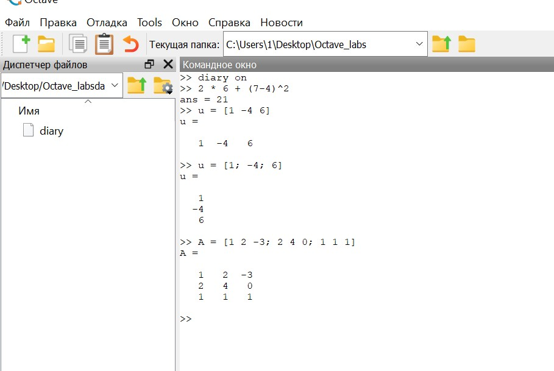
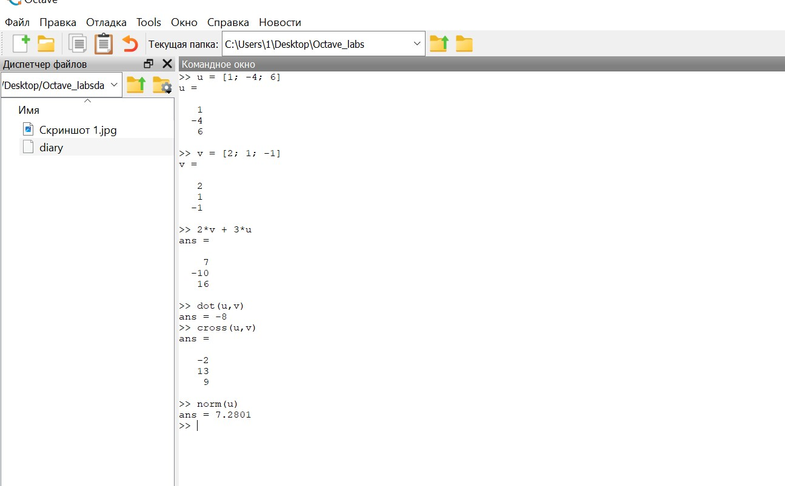
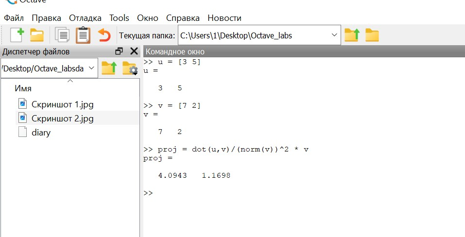
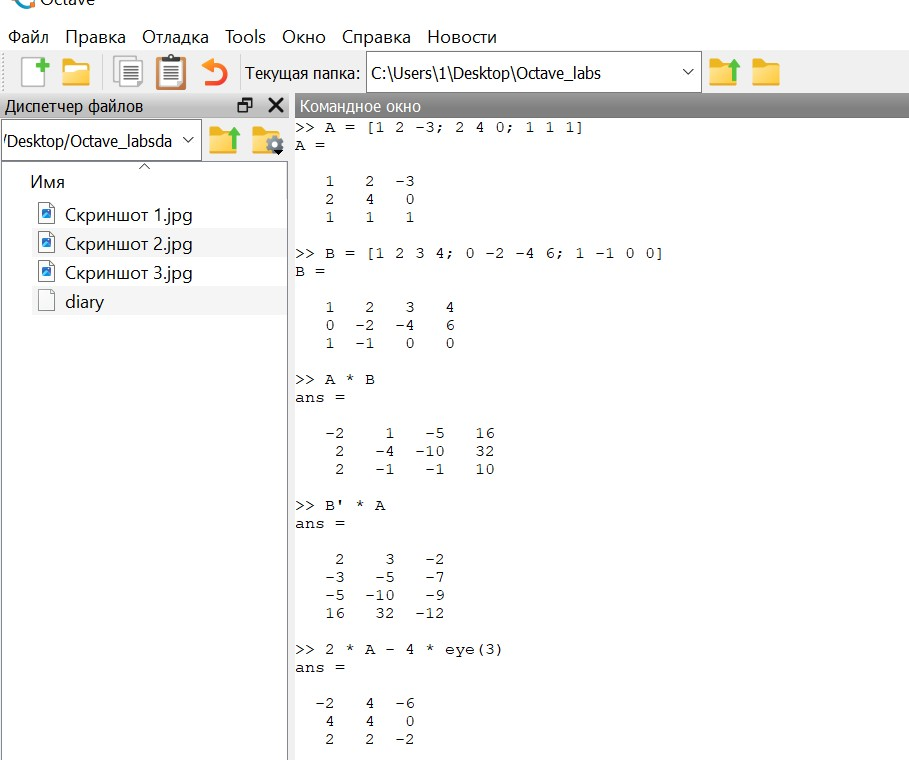
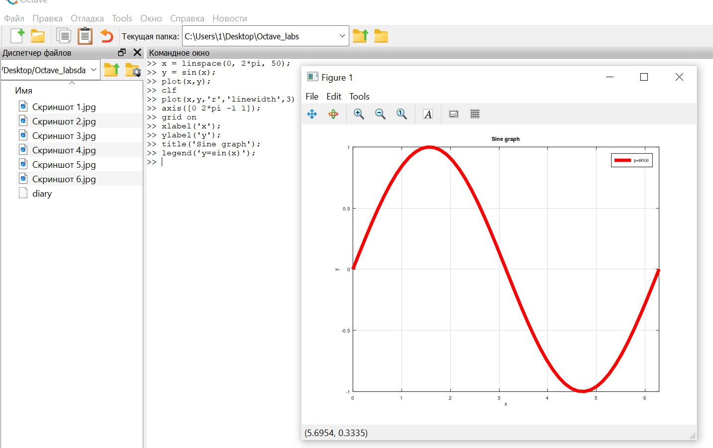
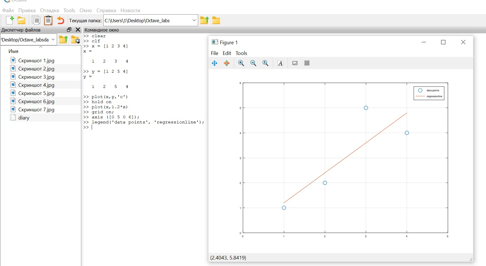
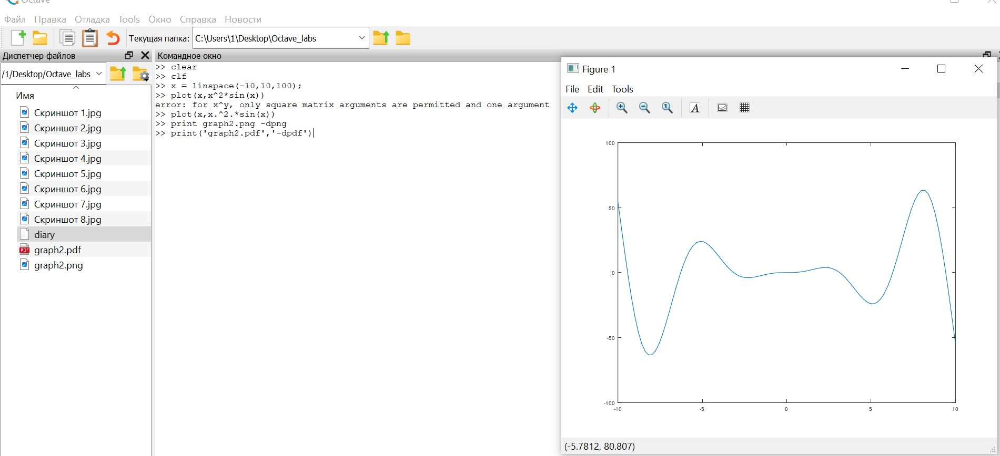
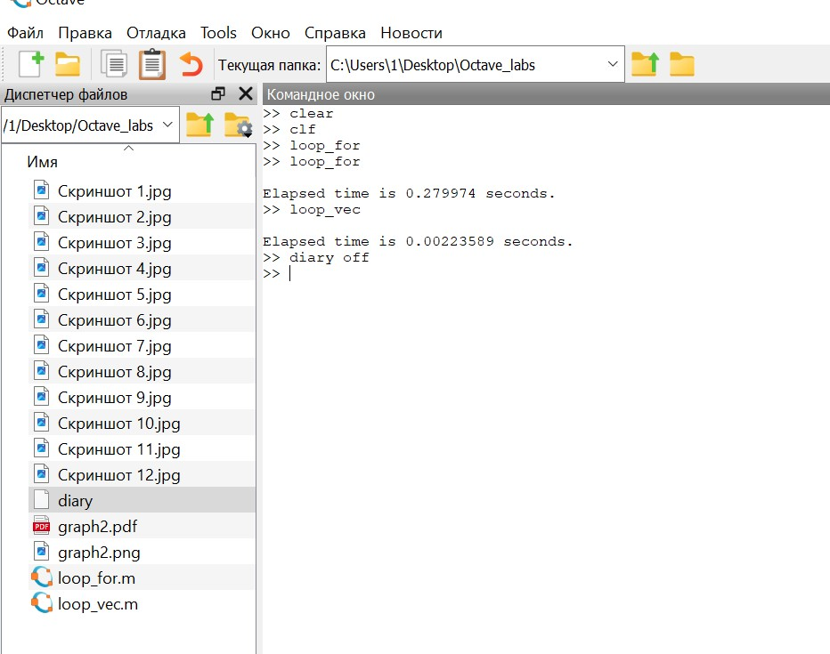

---
## Front matter
lang: ru-RU
title: Лабораторная работа №3
subtitle: Научное программирование
author:
  - Таубер Кирилл Олегович
institute:
  - Российский университет дружбы народов
  - Москва, Россия
date: 3 февраля 2024

## i18n babel
babel-lang: russian
babel-otherlangs: english

## Formatting
mainfont: PT Serif
romanfont: PT Serif
sansfont: PT Sans
monofont: PT Mono
toc: false
slide_level: 2
theme: metropolis
header-includes: 
 - \metroset{progressbar=frametitle,sectionpage=progressbar,numbering=fraction}
 - '\makeatletter'
 - '\beamer@ignorenonframefalse'
 - '\makeatother'
aspectratio: 43
section-titles: true
---

## Цель лабораторной работы

Освоить базовые навыки работы в Octave: простейшие вычислительные операции, операции с векторами и матрицами, построение простейших графиков, сравнение циклов и операций с векторами.

## Теоретическое введение

__Octave__ — высокоуровневый интерпретируемый язык программирования, предназначенный для решения задач вычислительной математики. По возможностям и качеству реализации интерпретатора язык Octave можно сравнивать с проприетарной программой MATLAB, причём синтаксис обоих языков очень схож. В состав пакета входит интерактивный командный интерфейс (интерпретатор Octave).

## Ход выполнения лабораторной работы
- Вычислили значение выражения. Задали вектор-строку, вектор-столбец и матрицу

{ #fig:001 width=60% }

## Ход выполнения лабораторной работы
- Осуществили сложение заданных векторов, их скалярное и векторное умножение. Нашли норму одного из векторов

{ #fig:002 width=60% }

## Ход выполнения лабораторной работы
- Ввели два вектора-строки. Вычислили проекцию одного вектора на другой

{ #fig:003 width=70% }

## Ход выполнения лабораторной работы
- Вычислили произведение матриц, а также их произведение с учетом транспонирования одной из матриц. Вычислили выражение, содержащее единичную матрицу. Нашли определитель матрицы, обратную для нее, вычислили собственные значения матрицы и ее ранг

{ #fig:004 width=40% }

## Ход выполнения лабораторной работы
- Создали вектор значений $x$. Задали вектор $y = sin(x)$ и построили график

{ #fig:007 width=70% }

## Ход выполнения лабораторной работы
- Задали два вектора и начертили эти точки, используя кружочки как маркеры. Ввели команду для добавления еще одного графика к текущему. Добавили график регрессии

{ #fig:008 width=70% }

## Ход выполнения лабораторной работы
- Построили график $y = x^2sin(x)$

{ #fig:009 width=80% }

## Ход выполнения лабораторной работы

- Сравним эффективность работы с циклами и операций с векторами. Для этого вычислим сумму: $S = \sum_{n}^{100000}$ $\frac{1}{n^2}$. Вычислим сумму $S$ сначала с помощью цикла, а затем вычислим сумму $S$ с помощью операций с векторами

{ #fig:012 width=45% }

## Вывод
- В ходе выполнения данной лабораторной работы я освоил базовые навыки работы в Octave: простейшие вычислительные операции, операции с веторами и матрицами, построение простейших графиков, сравнение циклов и операций с векторами.