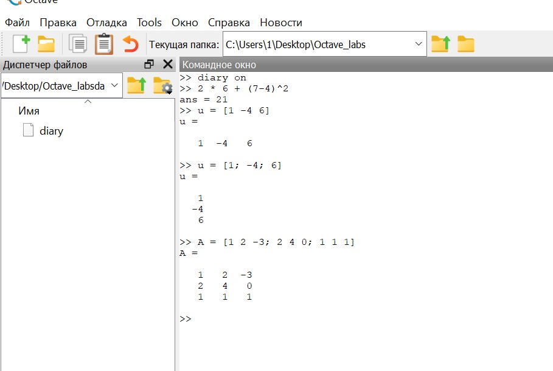
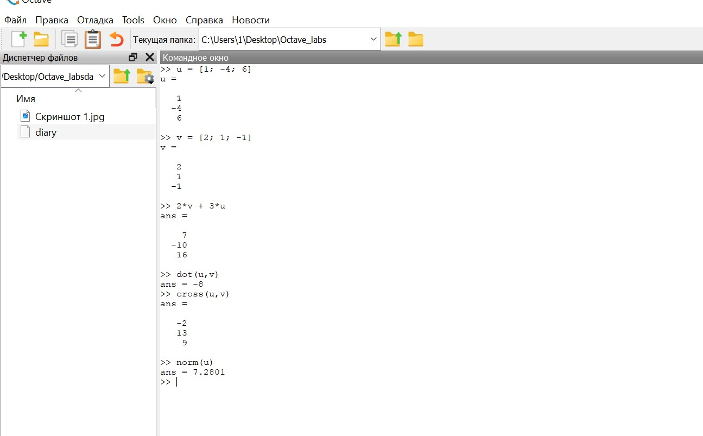
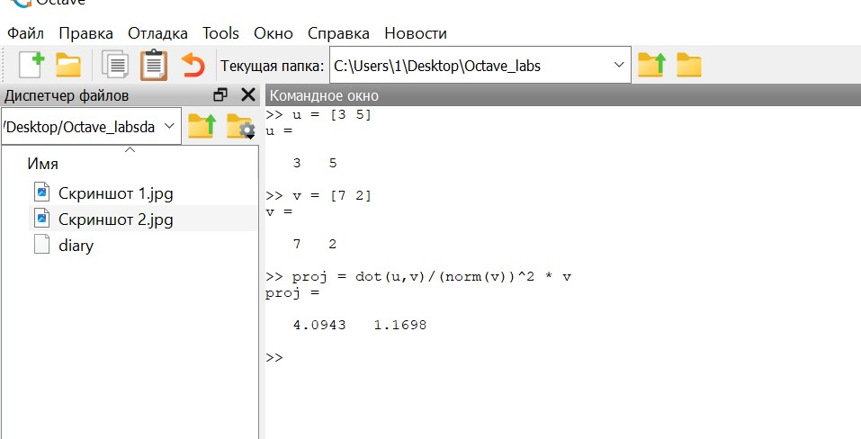
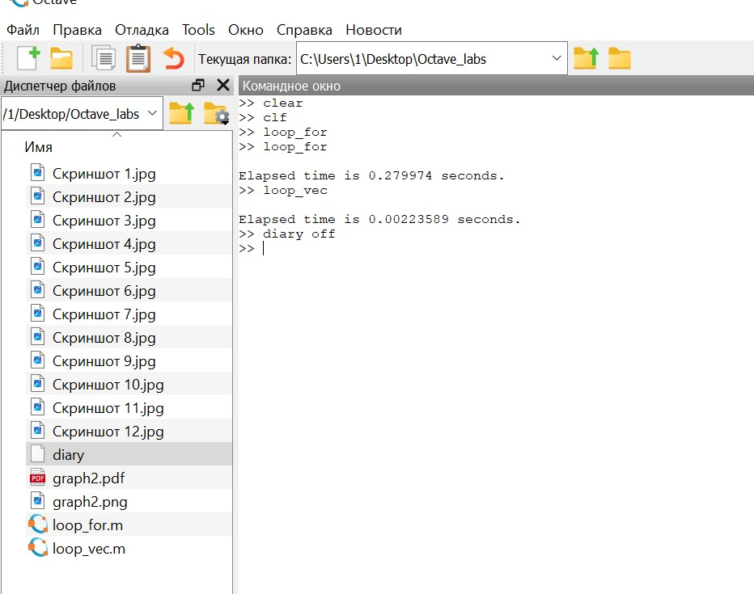

---
## Front matter
title: "Лабораторная работа №3"
subtitle: "Научное программирование"
author: "Таубер Кирилл Олегович"

## Generic otions
lang: ru-RU
toc-title: "Содержание"

## Bibliography
bibliography: bib/cite.bib
csl: pandoc/csl/gost-r-7-0-5-2008-numeric.csl

## Pdf output format
toc: true # Table of contents
toc-depth: 2
lof: true # List of figures
fontsize: 12pt
linestretch: 1.5
papersize: a4
documentclass: scrreprt
## I18n polyglossia
polyglossia-lang:
  name: russian
  options:
	- spelling=modern
	- babelshorthands=true
polyglossia-otherlangs:
  name: english
## I18n babel
babel-lang: russian
babel-otherlangs: english
## Fonts
mainfont: PT Serif
romanfont: PT Serif
sansfont: PT Sans
monofont: PT Mono
mainfontoptions: Ligatures=TeX
romanfontoptions: Ligatures=TeX
sansfontoptions: Ligatures=TeX,Scale=MatchLowercase
monofontoptions: Scale=MatchLowercase,Scale=0.9
## Biblatex
biblatex: true
biblio-style: "gost-numeric"
biblatexoptions:
  - parentracker=true
  - backend=biber
  - hyperref=auto
  - language=auto
  - autolang=other*
  - citestyle=gost-numeric
## Pandoc-crossref LaTeX customization
figureTitle: "Рис."
tableTitle: "Таблица"
listingTitle: "Листинг"
lofTitle: "Список иллюстраций"
lolTitle: "Листинги"
## Misc options
indent: true
header-includes:
  - \usepackage{indentfirst}
  - \usepackage{float} # keep figures where there are in the text
  - \floatplacement{figure}{H} # keep figures where there are in the text
---

# Цель работы

Освоить базовые навыки работы в Octave: простейшие вычислительные операции, операции с веторами и матрицами, построение простейших графиков, сравнение циклов и операций с векторами.

# Теоретическое введение

__Octave__ — высокоуровневый интерпретируемый язык программирования, предназначенный для решения задач вычислительной математики. По возможностям и качеству реализации интерпретатора язык Octave можно сравнивать с проприетарной программой MATLAB, причём синтаксис обоих языков очень схож. В состав пакета входит интерактивный командный интерфейс (интерпретатор Octave). Интерпретатор Octave запускается из терминала ОС Linux или из его порта в Windows. После запуска Octave пользователь видит окно интерпретатора. 

В окне интерпретатора пользователь может вводить как отдельные команды языка Octave, так и группы команд, объединяемые в программы. Если строка заканчивается символом ";", результаты на экран не выводятся. Если же в конце строки символ ";" отсутствует, результаты работы выводятся на экран. Текст в строке после символа \% является комментарием и интерпретатором не обрабатывается.

Octave имеет большое количество инструментов для решения распространенных задач числовой линейной алгебры, поиска корней нелинейных уравнений, интегрирования обычных функций, управления полиномами, интегрирования обыкновенных дифференциальных и дифференциально-алгебраических уравнений и т.д. Помимо этого в Octave можно рисовать графики. Функционал этой программной системы может быть легко расширен и перенастроен с помощью пользовательских функций, написанных на собственном языке программирования Octave, либо с помощью динамически загружаемых модулей, написанных на C++, C, Fortran или других языках.

В Octave реализованы многие возможности Matlab, включая использование матриц в качестве основных типов данных, поддержку комплексных чисел, поддержку математических функции и больших библиотек функций, а также возможность создания пользовательских функций для расширения функциональности системы.

Более подробно см. в [@Octave_1:bash] и [@Octave_2:bash].

# Выполнение лабораторной работы

Для начала включили журналирование сессии, создав документ "diary". Вычислили значение выражения. Задали вектор-строку (ковектор), вектор-столбец (вектор) и матрицу (рис. @fig:001).

{#fig:001 width=90%}

Задали два вектора-столбца. Осуществили сложение заданных векторов, их скалярное и векторное умножение. Нашли норму одного из векторов (рис. @fig:002).

{#fig:002 width=90%}

Ввели два вектора-строки. Вычислили проекцию одного вектора на другой (рис. @fig:003).

{#fig:003 width=90%}

Ввели две матрицы. Вычислили их произведение, а также их произведение с учетом транспонирования одной из матриц. Вычислили выражение, содержащее единичную матрицу. Нашли определитель матрицы, обратную для нее, вычислили собственные значения матрицы и ее ранг (рис. @fig:004 и рис. @fig:005).

{#fig:004 width=90%}

{#fig:005 width=90%}

Создали вектор значений $x$. Задали вектор $y = sin(x)$ и построили график. Очистили рабочую область фигуры для дальнейшего улучшения графика. Задали красный цвет для линии и сделали ее потолще. Подогнали диапазон осей и нарисовали сетку. Подписали оси и сделали заголовок графика, а также задали легенду (рис. @fig:006 и рис. @fig:007).

{#fig:006 width=90%}

{#fig:007 width=90%}

Очистили память и рабочую область фигуры. Задали два вектора и начертили эти точки, используя кружочки как маркеры. Ввели команду для добавления еще одного графика к текущему. Добавили график регрессии. Задали сетку, оси и легенду (рис. @fig:008).

{#fig:008 width=90%}

Строим график $y = x^2sin(x)$. Очистим память и рабочую область фигуры. Зададим вектор $x$ и построим график, используя поэлементное возведение в степень и поэлементное умножение (в противном случае выдаст ошибку). Сохраним графики в виде файлов (на сохранении файла в формате pdf программа зависает) (рис. @fig:009).

{#fig:009 width=90%}

Сравним эффективность работы с циклами и операций с векторами. Для этого вычислим сумму: $S = \sum_{n}^{100000}$ $\frac{1}{n^2}$.

Очистим память и рабочую область фигуры. Вычислим сумму $S$ с помощью цикла, создав файл loop_for.m (рис. @fig:010).

{#fig:010 width=90%}

Вычислим сумму $S$ с помощью операций с векторами, создав файл loop_vec.m (рис. @fig:011).

{#fig:011 width=90%}

Запустив оба файла, видим, что время на выполнение второй программы в 100 раз меньше, чем на выполнение первой (рис. @fig:012). Таким образом, в данном случае операции с векторами эффективнее, чем циклы. В конце завершим запись в файл.

{#fig:012 width=90%}
 

# Вывод 

В ходе выполнения данной лабораторной работы я освоил базовые навыки работы в Octave: простейшие вычислительные операции, операции с веторами и матрицами, построение простейших графиков, сравнение циклов и операций с векторами.

# Список литературы{.unnumbered}

